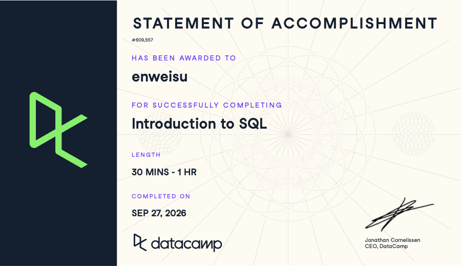

# Course-Completion Evidence

I completed the DataCamp Introduction to SQL course as part of the IBM 6500 course requirements. The certificate below provides evidence of course completion.

# Chapter1: Learning Notes and Key Takeaways

## Meet Databases & SQL

### Main Ideas

A database is an organized collection of data that allows information to be stored, managed, and retrieved efficiently. In a relational database, data is organized into tables. A table contains rows, which represent individual records, and columns, which represent attributes or fields.

SQL (Structured Query Language) is used to communicate with relational databases. SQL allows users to retrieve specific information from tables without manually searching through the entire dataset.

### Important SQL Syntax

The basic structure of a SQL query is:

\`\`\`sql SELECT column_name FROM table_name;

### SQL Example

\`\`\`sql SELECT customer_id, country FROM customers;

### CEP Application

This concept can be applied to marketing and CEP research by using SQL to retrieve customer or website data from large databases. For example, a marketing analyst could select customer characteristics, purchase information, or geographic data and use the results to understand different customer segments. This can support the identification of customer needs and behaviors that are relevant to a Category Entry Point (CEP) analysis.

## Chapter2: Write Your First SQL

### Main Ideas

SQL queries allow users to retrieve specific information from database tables. The `SELECT` statement is used to choose the columns to return, while the `FROM` clause identifies the table. SQL can also be used to limit the number of records, sort results, and identify the highest or lowest values in a dataset.

These basic query techniques are useful because they allow analysts to focus on the specific information needed for a business or marketing question instead of examining an entire database.

### Important SQL Syntax

Some useful SQL clauses for retrieving and organizing data include `SELECT`, `FROM`, `LIMIT`, and `ORDER BY`.

\`\`\`sql SELECT column_name FROM table_name ORDER BY column_name DESC LIMIT 10;

### SQL Example

\`\`\`sql SELECT product_name, price FROM products ORDER BY price DESC LIMIT 5;

### CEP Application

These SQL skills can support CEP research by helping analysts examine customer and product data from different perspectives. For example, a marketer could sort products by price or limit a query to a small number of records to identify important products or customer behaviors. These results can help the research team understand patterns in consumer behavior and connect those patterns to specific Category Entry Points.

## Chapter3: Complete Your SQL Foundation

### Main Ideas

SQL provides a foundation for working with structured data and answering questions from databases. By combining different SQL clauses, analysts can retrieve, organize, and examine information more efficiently.

Understanding the basic structure of SQL queries is important because these skills can be applied to larger and more complex datasets. Practicing SQL also helps build a foundation for data analysis and supports better decision-making based on data.

### Important SQL Syntax

SQL queries can combine multiple clauses to answer more specific questions. For example, `WHERE` filters records based on a condition, while `COUNT()` can be used to count the number of records that meet that condition.

\`\`\`sql SELECT COUNT(\*) FROM customers WHERE country = 'USA';

### CEP Application

These SQL skills can be applied to CEP research by helping marketers analyze customer characteristics and behaviors. For example, a marketing analyst could use SQL to count customers from a specific country, segment, or other relevant group. This type of analysis can help identify patterns in the customer base and provide evidence for understanding consumer needs and behaviors associated with different Category Entry Points.

# Overall Reflection and Future Reference

The Introduction to SQL course helped me develop a basic understanding of how SQL is used to work with structured data in relational databases. I learned how to retrieve specific information, organize query results, filter records, and perform basic calculations using SQL.

One of the most useful skills I learned was understanding how different SQL clauses work together to answer specific questions. I also found it important to understand how `SELECT`, `FROM`, `WHERE`, `ORDER BY`, and `LIMIT` affect the results of a query.

These SQL skills can support digital marketing analytics and customer insights by making it easier to work with large datasets. In CEP research, SQL can help analyze customer characteristics, behaviors, products, and other data that may reveal patterns related to consumer needs and Category Entry Points.

In the future, I would like to continue practicing SQL queries and become more comfortable working with larger datasets. The main concepts I plan to review are filtering data with `WHERE`, sorting with `ORDER BY`, limiting results with `LIMIT`, and using functions such as `COUNT()`.

# Appendix: Publication Links

-   **GitHub Repository:** [IBM 6500 SQL Learning Portfolio](https://github.com/WillySuu/ibm-6500-sql-learning-portfolio)
-   **Published Introduction to SQL Report:** [Introduction to SQL Report](https://willysuu.github.io/ibm-6500-sql-learning-portfolio/introduction-to-sql.html)
